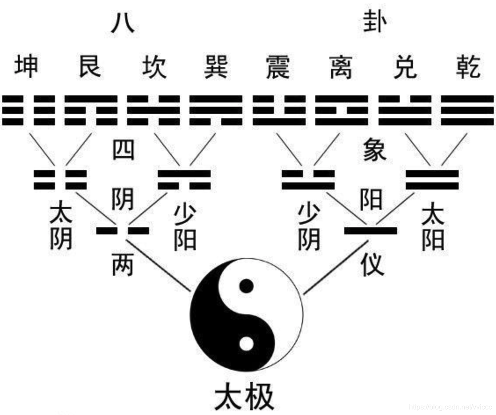

# Zhou Yi / The Book of Changes

[中文](readme.md)
[English](readme-En.md)
[日本語](readme-Ja.md)
[Français](readme-Fr.md)
[Deutsch](readme-De.md)

## Origin

The Book of Changes, also known as the Yi Jing, is a classic of ancient Chinese philosophy. At the time of its compilation, there were no written characters, so essentially, the Book of Changes is a collection of symbols, which later generations referred to as Yin and Yang.

The symbols of the Book of Changes are said to have originated from ancient agricultural civilizations, recording the solar terms and seasonal changes. Within tribes, there were individuals responsible for observing celestial phenomena, mountains, oceans, and sensing temperatures and atmospheric conditions. These people recorded the natural changes to guide agricultural activities and forecast potential disasters such as floods, droughts, and earthquakes.

This legend seems plausible. This book adopts this explanation as the origin of the Book of Changes.

In ancient China, despite the changes in dynasties, agricultural civilization remained constant. Observations and summaries of natural laws were highly valued throughout the ages. Therefore, the transmission of the Book of Changes has remained largely uninterrupted.

## What is the Book of Changes

The Book of Changes should be understood as "Zhou" and "Yi".
- "Zhou" represents an era, and it is generally believed that the extant Book of Changes was compiled during the Zhou Dynasty (1046 BC – 256 BC).
- "Yi" represents change.
So, the book we see today as "The Book of Changes" can be understood as a calendar of the Zhou Dynasty.

## Evolution and Fortune-telling

Since it describes a calendar, how did it become a philosophical book? A book for fortune-telling?
Firstly, much of the text in the current book has been added later. The original Book of Changes actually consisted only of symbols (Yin and Yang).

The textual part is interpretations provided by later generations based on their understanding to help comprehend these symbols.

Therefore, "Don't assume that what is written down is correct. Don't assume that what isn't written down is incorrect." We generally believe that "text is just one perspective" and "symbols are also a perspective". Therefore, understanding through one's own life experiences, "your feelings are the most valuable to you."

Due to the lack of text and the inconvenience of early writing, the symbols of the Book of Changes are extremely concise. So, "there are a thousand Hamlets in a thousand people's eyes."

Since there is something that is difficult for anyone to explain and has been passed down from a long time ago (humans tend to worship antiquity), mysticism inevitably accompanies it.

Some typical attitudes are:
- "If I'm wrong, it's okay, it's just a joke." Eventually, time makes everything forgotten.
- "If I'm right, oh, this is really amazing! Quickly recommend the master to relatives and friends!" And then embellish it.

This is also a very typical "cognitive bias". We have a "deep memory of predictions that come true." So, the dissemination of objectively guessed predictions among people is far greater than fifty-fifty. The impact of correctly predicted events far exceeds that of incorrect predictions.

### Fortune-telling?

Is it fortune-telling? Yes. Do we believe in fate? Not necessarily.
Almost everyone who encounters the Book of Changes may have tried to "consult the oracle". In fact, it's not a big deal.

But, there are some understandings that need to be in place beforehand, otherwise, it's easy to be misled.
- Why fortune-telling? To seek good fortune and avoid calamity.
- Why seek good fortune and avoid calamity? To pursue one's own interests.
- Not pursuing one's own interests, but accepting everything in life peacefully.
- Most people can't do it, like me.
- So, what should we do?
- Think carefully about fortune-telling. What is real, and what is illusory?
- Historical patterns, social experiences, the laws of development of things, these are real.
- As for definitive judgments and miraculous windfalls, forget about them, they're basically illusions.
- The Book of Changes can provide some reference for your life. But beyond that, it's not reliable.

There's much more to discuss, let's delve into it further in specific chapters. This is just the beginning.

## About Me

A "junior student" in the field of the Book of Changes.
Studying the Book of Changes is a fascinating thing. Welcome everyone to exchange and correct.
Contact: fjchenh2015@163.com
