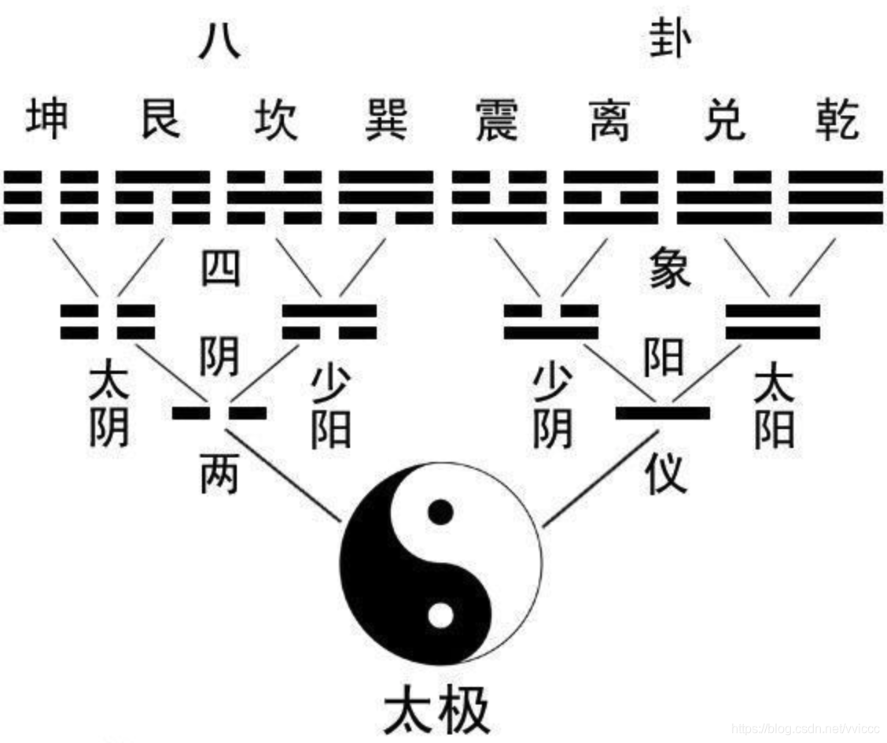

# Le Yi King
[中文](readme.md)
[English](readme-En.md)
[日本語](readme-Ja.md)
[Français](readme-Fr.md)
[Deutsch](readme-De.md)

## Origine

Le Yi King, également appelé I Ching, est un classique de la philosophie ancienne chinoise.
À l'époque de sa rédaction, l'écriture n'existait pas encore, donc, essentiellement, le Yi King est un ensemble de symboles. C'est ce que l'on appelle plus tard le Yin et le Yang.

Les symboles du Yi King, selon la légende, proviennent de l'ancienne civilisation agricole et des enregistrements des saisons. Dans les tribus, des personnes spécifiques étaient responsables de l'observation des astres, des montagnes et des mers, et ressentaient les températures et les quatre saisons. Ces personnes enregistraient les changements naturels pour guider les travaux agricoles et prévoyaient également de potentiels grands désastres tels que les inondations, les sécheresses et les tremblements de terre.

Cette légende semble raisonnable. Ce livre adopte cette explication comme origine de la rédaction du Yi King.

Dans l'ancienne Chine, malgré le changement de dynasties, la civilisation agricole restait inchangée. L'observation et la synthèse des lois naturelles étaient très valorisées à travers les âges. Ainsi, la transmission du Yi King n'a pratiquement jamais été interrompue.

## Qu'est-ce exactement que le Yi King

Le Yi King devrait être considéré comme "Yi" et "King".
"Yi" signifie changement.
Il est généralement admis que le Yi King actuel a été rédigé sous la dynastie Zhou (1046 av. J.-C. à 256 av. J.-C.).
Donc, le livre que nous voyons aujourd'hui, le Yi King, peut être compris comme un livre de calendrier de la dynastie Zhou.

## Évolution et divination

Comment un livre sur le calendrier est-il devenu un ouvrage philosophique ? Un livre de divination ?
Tout d'abord, une grande partie du texte actuel a été ajoutée ultérieurement. L'original du Yi King était en fait composé uniquement de symboles (Yin et Yang).

La partie textuelle a été ajoutée par des personnes ultérieures, basées sur leur propre interprétation, pour aider à comprendre ces symboles.

Ainsi, "ne pensez pas que ce qui est écrit est correct. Ne pensez pas que ce qui n'est pas écrit est incorrect." Nous avons tendance à croire que "le texte est une perspective" et que "les symboles sont une autre perspective". En liant cela à votre propre vie, "vos sentiments sont ce qu'il y a de plus précieux pour vous".

En raison de l'absence de texte et de la difficulté d'écrire à l'époque, les symboles du Yi King sont extrêmement simplifiés. Ainsi, "il y a mille Hamlets dans les yeux de mille spectateurs".

Lorsqu'il y a quelque chose que personne ne peut expliquer clairement et qui vient de loin (tendance à vénérer l'antiquité), l'ésotérisme est inévitable.

Certains états d'esprit typiques sont :
"Si c'est faux, pas de problème, c'était juste une plaisanterie." Avec le temps, tout est oublié.
"Si c'est vrai, oh, c'est vraiment miraculeux ! Recommandez vite le maître à la famille et aux amis !" Puis exagérez un peu plus.

C'est aussi un "biais cognitif" typique. Nous avons un souvenir profond des prédictions qui se réalisent. Ainsi, une estimation objective à parts égales n'est pas diffusée de la même manière parmi les gens. L'impact de la diffusion des prédictions correctes est bien plus grand que celui des prédictions erronées.

### Divination ?

Diviner ? Oui. Croire en la destinée ? Pas nécessairement.
Presque tous ceux qui ont été en contact avec le Yi King ont probablement essayé de "tirer un hexagramme". Ce n'est pas vraiment une grande affaire.

Cependant, certaines connaissances préalables sont nécessaires pour éviter d'être induit en erreur.
- Pourquoi faire de la divination ? Pour chercher la chance et éviter le malheur.
- Pourquoi chercher la chance et éviter le malheur ? Pour poursuivre son propre intérêt.
- Ne pas poursuivre son propre intérêt, mais accepter sereinement tout ce que la vie offre.
- La plupart des gens ne peuvent pas le faire, moi y compris.
- Alors, que faire ?
- Pensez bien, dans la divination, qu'est-ce qui est réel et qu'est-ce qui est illusoire ?
- Les lois historiques, l'expérience sociale, les règles du développement des choses, celles-ci sont réelles.
- Les affirmations catégoriques, les jugements comme si des cadeaux tombaient du ciel, oubliez-les, ils sont généralement illusoires.
- Le Yi King peut vous fournir quelques références pour votre vie. Pour le reste, ce n'est pas le cas.

Il y a encore beaucoup à dire, que nous expliquerons plus en détail dans les sections spécifiques, mais considérez cela comme une introduction.

## À propos de moi

Un "élève" en matière de Yi King.
Étudier le Yi King est une chose très intéressante, je vous invite à échanger et à corriger.
fjchenh2015@163.com
